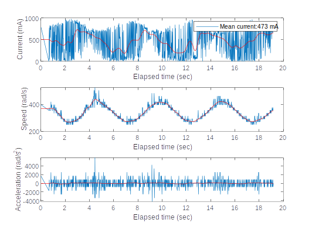

# dc-motor-testbed

Test bed development for the study of low-power DC motor specifications such as speed, acceleration, response time, power consumption, etc.

The test bed is based on an STM32 Nucleo-L152RE development board, where the C control code is executed.
A small motor driver generates the power signal, which is supplied through a USB connection.
The USB connects to a laptop where a MATLAB script is executed to process and visualize the data as shown below:

An ad hoc optical encoder was developed to make the learning process more comprehensive.

For the same reason, an OLED screen was added to the system, connected to the microcontroller through one of its I2C ports.

Finally, a 4x3 keypad matrix acts as the user interface. It allows the selection of different control signals: 1 to 5V supply, triangular, sawtooth, and sine waveforms, as well as a stop command.

You can find more info about HW componentes in the next link:
https://www.hackster.io/rubinsan/dc-motors-hands-on-study-02742c

Video with an example of execution:

<a href="https://www.youtube.com/watch?v=YV4XwpWuwdg">
</>

